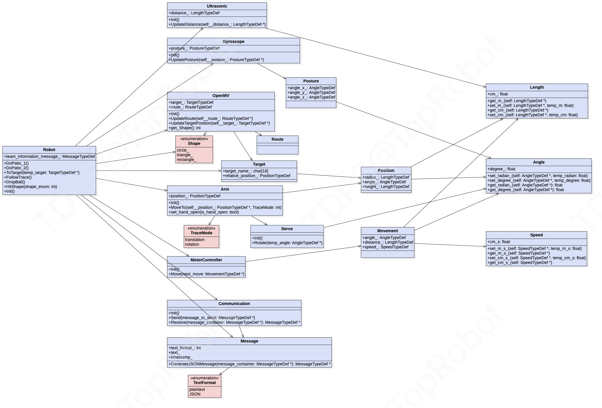
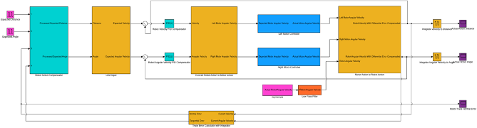
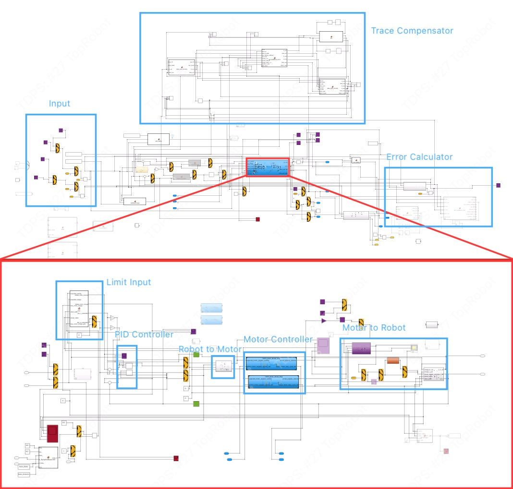
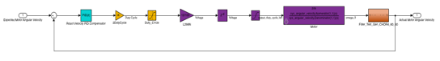
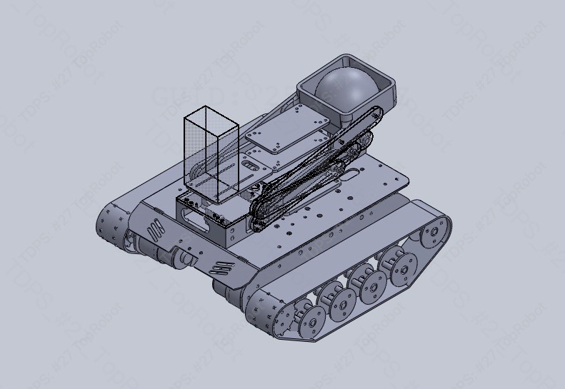
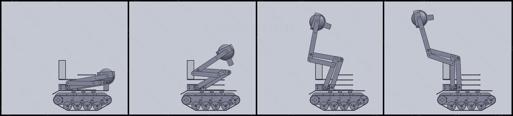
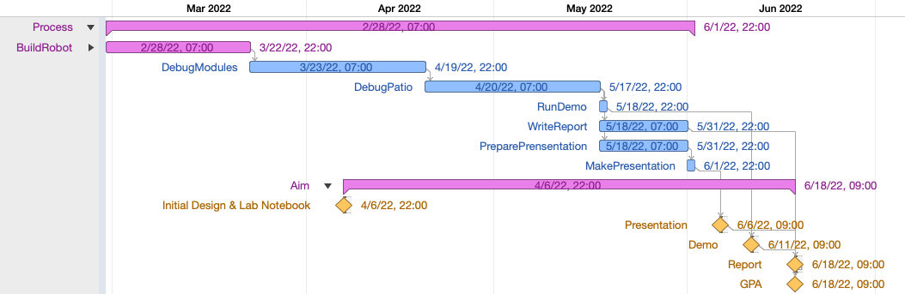

<!--- Source file(s) of this README: -->
<!--- 
Markdown: input: "_readme_blueprint.md" 
JSON: input config: "_readme_blueprint.json" 
JSON: config data: "config_data.json" 
JSON: package: "_readme_package.json" -->
 

  
  <h3 align="center">@renhong-zhang/stm32-crawler-robot-platform</h3>
  

    <b>A Crawler Robot Project Based on STM32 H7 and STM32 F4</b> 
    This crawler robot is a multitasking platform with sensing, data processing, decision-making, and path-following functions managed by a closed-loop control system with high accuracy and fast response. I am the Team Leader of this ten-person Robot Project. My responsibilities include member recruitment, project management, software & hardware design, STM32 coding, control system design & implementation, 3D modeling & printing, and so on. I put the hardware library I coded and the control system I designed in this repository.
         
        <a href="https://github.com/renhong-zhang/stm32-crawler-robot-platform#Demo">View Demo</a>
        ·
        <a href="https://github.com/renhong-zhang/stm32-crawler-robot-platform/issues/new?assignees=-&labels=bug&template=bug_report.yml">Report
          bug</a>
        ·
        <a href="https://github.com/renhong-zhang/stm32-crawler-robot-platform/issues/new?assignees=&labels=feature&template=feature_request.yml">Request
          feature</a>
  

<table border="0" width="100%" id="badge" cellspacing="0" cellpadding="0">
  <tr>
    <td>Prerequisites</td>
    <td></td>
  </tr>
  <tr>
    <td>Languages & Tools</td>
    <td>      </td>
  </tr>
  <tr>
    <td>License</td>
    <td></td>
  </tr>
  <tr>
    <td>State</td>
    <td></td>
  </tr>
</table>



	
<big><b>Table of Contents</big></b>

	<ol>
		<li><a href="#about-the-project">About The Project</a></li>
<ul><li><a href="#framework">Framework</a></li></ul>
<ul><li><a href="#control-system">Control System</a></li></ul>
<ul><li><a href="#hardware-programming">Hardware Programming</a></li></ul>
<ul><li><a href="#pcb-design-">PCB Design </a></li></ul>
<ul><li><a href="#3d-design-and-printing-">3D Design and Printing </a></li></ul>
<ul><li><a href="#note-and-latex">Note and LaTeX</a></li></ul>
<ul><li><a href="#management">Management</a></li></ul>
<ul><ul><li><a href="#project-management-">Project Management </a></li></ul></ul>
<ul><ul><li><a href="#code-management-">Code Management </a></li></ul></ul>
<ul><li><a href="#built-with">Built With</a></li></ul>
<li><a href="#author-">Author </a></li>
<li><a href="#how-can-i-support-you">How can I support you?</a></li>
<li><a href="#acknowledgments">Acknowledgments</a></li>
<li><a href="#license">License</a></li>
	</ol>

## About The Project

### Framework

This robot is built from the ground up, and its main methods are defined before implementation. I designed the robot's code structure with Universal Modelling Language using ideas similar to object-oriented programming in C++, Python, and other languages (UML). Furthermore, because no tool exists to generate C code from a UML model, I created one using javascript that converts the model to C code that works well with the STM32's HAL. 

### Control System

I created this controller using Matlab and Simulink, and the `C` code generated by the controller runs successfully on the STM32 board. The algorithm instructs the robot to follow the expected path precisely. 
This model's screenshots and overview are shown below.

### Hardware Programming

The code used to control each component is carefully coded and tested using an oscilloscope to monitor input and output signals. You can find these codes in the `./Hardware/` directory.

### PCB Design 

I designed an STM32 F411CEU6 board with Cadence and its Allegro PCB Designer to control the servo and motor with the control system. 

### 3D Design and Printing 

By utilizing a linkage structure, the robot could easily drop a tennis ball into the basket as the task required. This structure has been meticulously calculated and modeled in Solidworks. Furthermore, to ensure that the components' installation does not conflict, I built the robot model using the data from the component documentation and the data I measured. After completing these steps, I ordered 3D printing with the corresponding files. 

### Note and LaTeX

The experiments have well-formatted markdown notes generated as formal experiment notes with recorded details in a suitable format using the LaTex template I created and the Pandoc.

### Management

#### Project Management 

I managed this project using the project management tool `OmniPlan`, and tools I created to ensure a direct link between the project plan and all of our team members. Our project's Gantt Chart is shown below. 
 

#### Code Management 

I defined our code's style guide based on Google's C++ Style Guide to ensure the quality of code from each member.  And the code is all managed with the GitHub Workflow.

### Built With

<table border="0" width="100%" id="badge" cellspacing="0" cellpadding="0">
  <tr>
    <td><b>Major Frameworks/Libraries</b></td>
    <td>
             
    </td>
  </tr>
</table>

## Author 

<table border="0" width="100%" style="margin: 0px;" id="badge" cellspacing="0">
    <tr>
        <td width="20%">
            
        </td>
        <td><big><b>Renhong Zhang</b></big>
             
            Github: <a href="https://github.com/renhong-zhang">@renhong-zhang</a>
        </td>
    </tr>
</table>

## How can I support you?

There are lots of ways to support me! I would be so happy if you give this repository a ⭐️ and tell your friends about this little corner of the Internet.

## Acknowledgments

## License

[GNU General Public License version 3](https://opensource.org/licenses/GPL-3.0)

Copyright © 2022-present, Renhong Zhang
